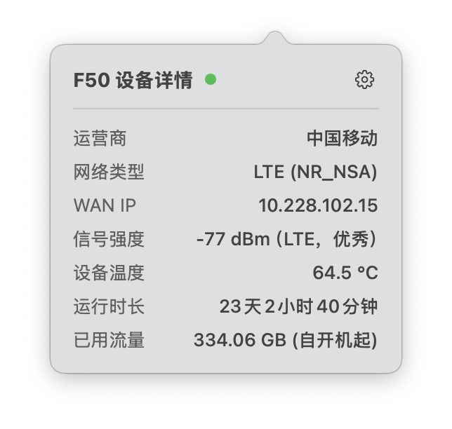

# ZTE F50 Monitor

[English](#english) | [中文](#chinese)

<h2 id="english">English</h2>

ZTE F50 Monitor is a hardware status monitoring tool designed for the ZTE F50 5G Portable Wi-Fi. It extracts real-time metrics (temperature, network speed, signal strength, and carrier information) directly from the device's hardware via a Magisk module, and displays them natively in the macOS menu bar.

### Features
- **Hardware-Level Precision**: A native Linux ARM64 daemon runs directly on the F50, reading thermal zones and network interfaces for accurate data without draining the device's battery.
- **Automated Deployment**: Includes a Python-based CLI tool that handles cross-compiling, Magisk module packaging, and ADB flashing in one click.
- **Native macOS Client**: A lightweight, SwiftUI-based menu bar application that polls the F50's API and displays live metrics seamlessly.

### Requirements
- **F50 Device**: Rooted with Magisk installed. ADB debugging enabled and accessible from the Mac.
- **Mac**: macOS 11.0 or later.
- **Dependencies**: `go` (for compiling the device daemon) and `python3` (for the deployment script).

### Usage
1. **Deploy the backend**: Run `python3 backend/launcher.py` and select option `[1]` to build and install the Magisk module to your connected F50 device.
2. **Build the frontend**: Run `sh frontend/build_app.sh` to compile the macOS menu bar app. Launch `F50Monitor.app` from the output directory.

---

<h2 id="chinese">中文</h2>

ZTE F50 Monitor 是一款专为中兴 F50 5G 随身 WiFi 设计的极客监控工具。它通过 Magisk 模块直接在底层读取硬件状态，并将关键数据（温度、上下行网速、运营商、外网 IP）实时展示在 Mac 电脑的菜单栏中。

### 核心特性
- **硬件级采集**：通过交叉编译的原生 ARM64 守护进程，直接读取设备的 `/sys/class/thermal` 和 `/proc/net/dev` 节点，提供高精度的温度与流量数据，且几乎不占用设备性能。
- **自动化部署**：内置 Python 终端管理脚本。通过 ADB 连接手机后，即可一键完成跨平台编译、Magisk 模块打包、刷入系统与服务重启。
- **原生 Mac 客户端**：采用纯 SwiftUI 构建，作为常驻状态栏应用运行，提供极简的网速温度看板与详细的弹出面板。

### 环境依赖
- **设备端**：已获取 Root 权限并安装 Magisk，开启 ADB 调试并连接至 Mac。
- **Mac 端**：macOS 11.0 以上系统。需安装 `go`（用于交叉编译后端）和 `python3`。

### 使用方法
1. **后端部署**：在终端运行 `python3 backend/launcher.py`，选择 `[1]` 执行一键编译并刷入设备。请注意在设备上允许 Root 权限。
2. **前端构建**：在终端运行 `sh frontend/build_app.sh` 编译 Mac 应用。运行生成的 `F50Monitor.app` 即可监控。

---
### 友情链接 / Links
- [LINUX DO](https://linux.do/)
- [UFI-TOOLS (安卓随身 WiFi 折腾工具)](https://github.com/kanoqwq/UFI-TOOLS)
